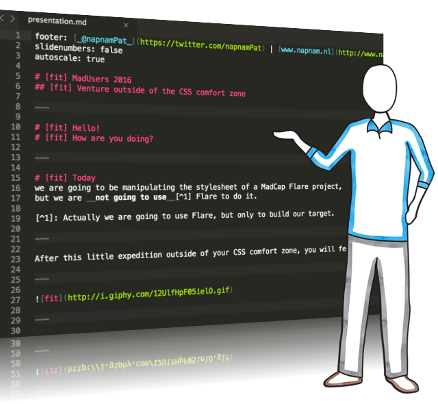

footer: [_@napnamPat_](https://twitter.com/napnamPat) | [www.napnam.nl](http://www.napnam.nl)
slidenumbers: false
autoscale: true

# [fit] MadUsers 2016
## [fit] Venture outside of your *CSS* comfort zone

---

# [fit] Hello! 
# [fit] How are you doing?

---

# [fit] Today 
We are going to be manipulating the stylesheet of a MadCap Flare project, but we are *__not__* going to use Flare[^1] to do it. 

[^1]: Actually we are going to use Flare, but only to build our target.

---

After this little expedition outside of your CSS comfort zone, you will feel like...

---


---
# [fit] What do you need?
---

##What do you need?

* A laptop with Flare 12 installed and running
* A text editor 
(notesblok or notepad will do for now[^2])

[^2]: A more advanced text editor is recommended, especialliy one that supports syntax highlighting

---
nieuwe slide

---
=======


---

^This slide is about changing the x-ref styles outside of the stylesheet editor.

## The X-Ref
In Flare we use the x-ref for linking to other content in- and outside of the Flare project.

---

## The X-Ref (default styling in style editor)

PICTURE HERE

---

## The X-Ref (default styling in css file)
```
MadCap|xref
```
```css
 {
 	color: #2D8DCC;
 	font-weight: bold;
 	mc-format: '{para}';
 	text-decoration: underline;
 }

```
---

## The X-Ref (fancy styling)
```
MadCap|xref
```
```css
{
	background: #3498db;
	background-image: -webkit-linear-gradient(top, #3498db, #2980b9);
	background-image: -moz-linear-gradient(top, #3498db, #2980b9);
	background-image: -ms-linear-gradient(top, #3498db, #2980b9);
	background-image: -o-linear-gradient(top, #3498db, #2980b9);
	background-image: linear-gradient(to bottom, #3498db, #2980b9);
	-webkit-border-radius: 28;
	-moz-border-radius: 28;
	border-radius: 28px;
	font-family: Arial;
	color: #ffffff;
	font-size: 20px;
	padding: 10px 20px 10px 20px;
	text-decoration: none;
	mc-format: '{para}';
}
```

---

## The Drop-down
In Flare we can use drop-downs to make content appear at the click of a buttom (or thumb).

---

## Tables
To present data there is nothing like a fine table.

---

# [fit] Resources
Ready to start tinkering? Here are some great places to start!

---

## Text editors
* [Sublime Text 3](https://www.sublimetext.com/) - win & mac (paid)
* [Notepad++](https://notepad-plus-plus.org/) - win (free)
* [Atom](https://atom.io/) - win & mac (free)

---

## Learn more about CSS

* [CSS: The Definitive Guide, Fourth Edition](http://meyerweb.com/eric/thoughts/2012/10/01/csstdg4e/) (book)
* [CSS: The Missing Manual by David Sawyer McFarland](https://amzn.com/1491918055) (book)
* [Learn to Code HTML & CSS, created by designer & front-end developer Shay Howe](http://learn.shayhowe.com/html-css/) (course)
* [Advanced CSS: Best Practices for Formatting Notes, Tips, Cautions and Warnings in MadCap Flare" webinar](http://www.madcapsoftware.com/demos/player.aspx?v=d01db2694e8e6) (webinar)

---

# [fit] Join __me!__
My name is *Patrick Andriessen* and you can find me on: 

__[Twitter](https://twitter.com/napnamPat)__, __[GitHub](https://github.com/napnam/MadUsers2016)__ *and* __[Slack](https://madusers.slack.com)__.

---

# [fit] __Tak!__
# [fit] Thank you!
# [fit] Dank jullie wel!
