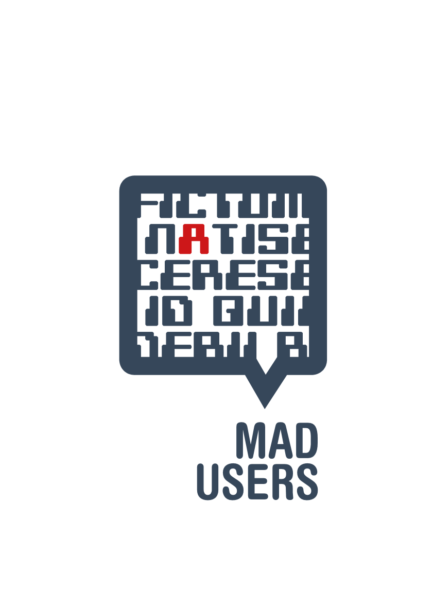
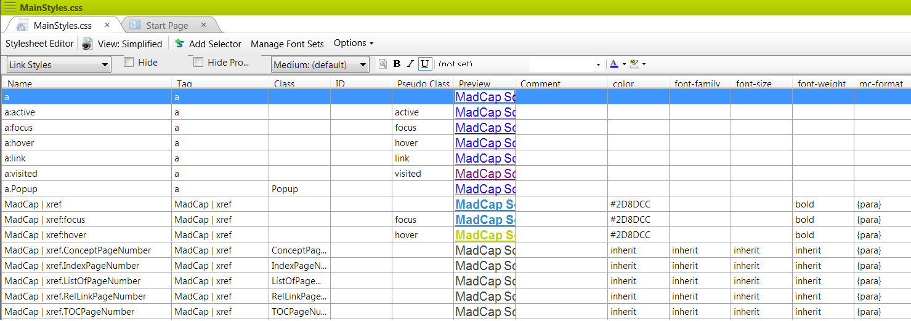
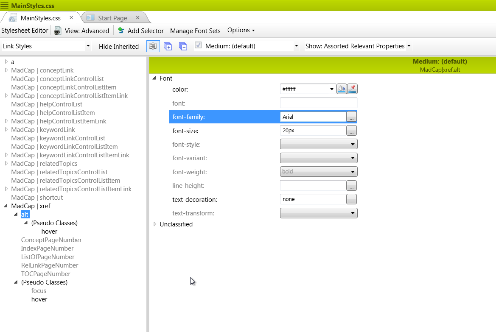
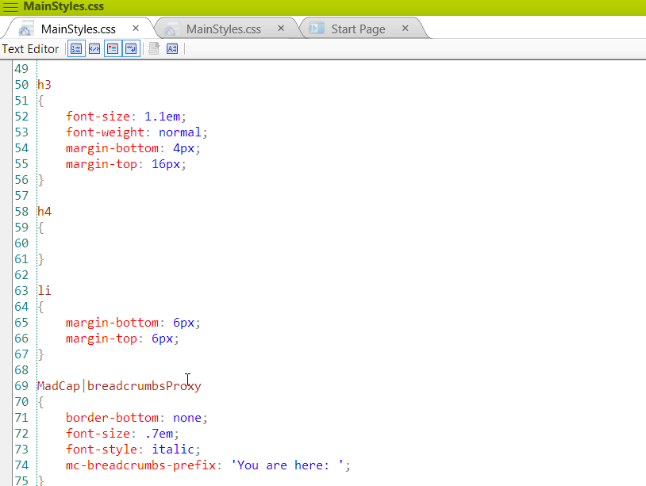
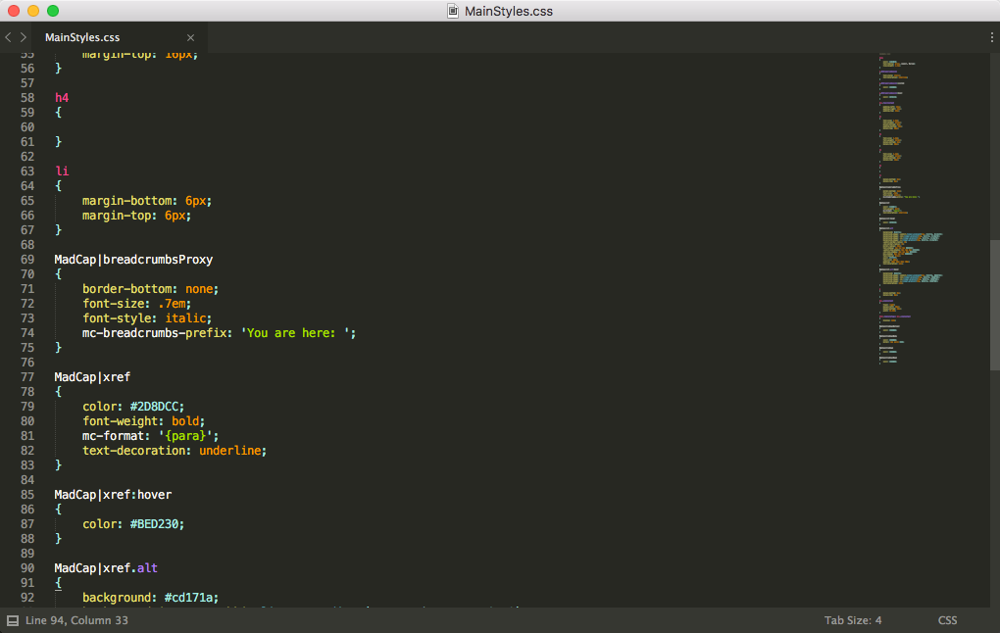
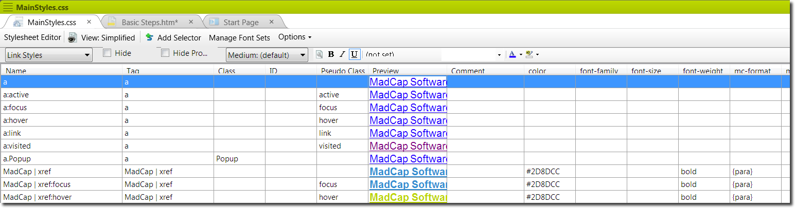
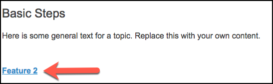
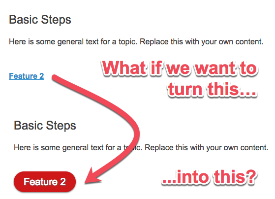
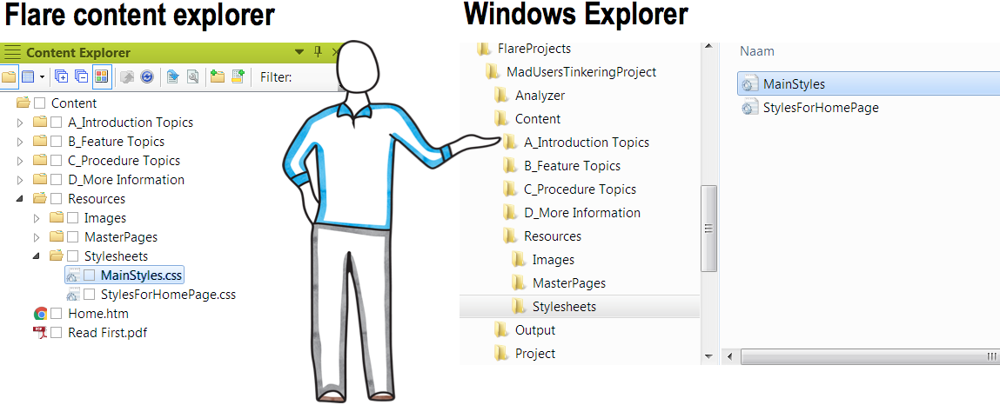

slidenumbers: false
autoscale: true
build-lists: true

## [fit] MadUsers 2016
## [fit] Venture outside of the *CSS* comfort zone

__Patrick Andriessen__
*napnam Publishing & Consulting*	

@napnamPat
patrick@napnam.nl

www.napnam.nl/madusers2016



---

# [fit] __Welcome__

---

# What are we going to do today?
* We'll be styling various elements in a MadCap Flare project. 
* We'll be using a text editor instead of Flare.
* This means that we'll be working on the code directly.

---

# What's in it for you?

1. With practice it is *lightning fast*.
2. You *learn* a lot about CSS.
3. You'll have *full control* over the CSS, so 
4. you can do more __fancy stuff__.

---

# Workshop agenda

1. MadCap Flare vs. Text Editor
2. Exercise: __The Cross Reference__
3. Exercise: __The Drop Down__
4. Exercise / demo: __Tables__
3. Wrap up

---

## [fit] MadCap Flare
vs. 
## [fit] Text Editor

---

# Question
## What do *you* use now?

---

Do you use the Flare Editor "Simple View?



---

Do you use the Flare Editor "Advanced View?



---

Do you use the Flare Internal Text Editor?



---

Or...do you use an external text editor?



---

## The X-Ref (default styling in style editor)



---

## The X-Ref (default styling in css file)



```
MadCap|xref
```
```css
 {	
 	color: #2D8DCC;
 	font-weight: bold;
 	mc-format: '{para}';
 	text-decoration: underline;
 }

```


---

## But wait...



---

## The X-Ref (button styling)
```
MadCap|xref
```
```css
{
background: #cd171a;
  background-image: -webkit-linear-gradient(top, #cd171a, #cc6e70);
  background-image: -moz-linear-gradient(top, #cd171a, #cc6e70);
  background-image: -ms-linear-gradient(top, #cd171a, #cc6e70);
  background-image: -o-linear-gradient(top, #cd171a, #cc6e70);
  -webkit-border-radius: 28;
  -moz-border-radius: 28;
  border-radius: 28px;
  text-shadow: 1px 1px 3px #666666;
  -webkit-box-shadow: 0px 1px 3px #666666;
  -moz-box-shadow: 0px 1px 3px #666666;
  box-shadow: 0px 1px 3px #666666;
  font-family: Arial;
  color: #ffffff;
  font-size: 20px;
  padding: 10px 20px 10px 20px;
  mc-format: '{para}';
  text-decoration: none;
}
```
---


# Time for some
# [fit] Exercises

---

# What do we need?

* Laptop with Flare installed (pref. v11 or up).
* HTML5 Top Navigation example project.
* Your text editor of choice.

---

# Before you begin

* Always make your changes in the project file not in the build!
* Backup your CSS before you start!

---

## Where is the css code located?



---

## [fit] Exercise 1
## [fit] The cross-reference

---

## [fit] Exercise 2
## [fit] The drop-down

---

# [fit] About tables

---

# Wrap up

---
## So, how was it?

Do you feel like cheering?


---

Or do you feel like Charlie Brown?


---

I would like to know, so here is a

## *question* for you

After this Would you consider using a text editor for your own projects in the future and why (or why not)?


---

## Recommended text editors
[*Sublime Text 3*](https://www.sublimetext.com/) - win & mac (paid)
https://www.sublimetext.com/

[*Atom*](https://atom.io/) - win & mac (free)
https://atom.io/

[*Notepad++*](https://notepad-plus-plus.org/) - win (free)
https://notepad-plus-plus.org/

---

## Learn more about CSS

[*CSS: The Definitive Guide, Fourth Edition*](http://meyerweb.com/eric/thoughts/2012/10/01/csstdg4e/) (book)
http://meyerweb.com/eric/thoughts/2012/10/01/csstdg4e/

[*CSS: The Missing Manual by David Sawyer McFarland*](https://amzn.com/1491918055) (book)
https://amzn.com/1491918055

[*Learn to Code HTML & CSS, created by designer & front-end developer Shay Howe*](http://learn.shayhowe.com/html-css/) (course)
http://learn.shayhowe.com/html-css/

[*Advanced CSS: Best Practices for Formatting Notes, Tips, Cautions and Warnings in MadCap Flare" webinar*](http://www.madcapsoftware.com/demos/player.aspx?v=d01db2694e8e6) (webinar)
http://www.madcapsoftware.com/demos/player.aspx?v=d01db2694e8e6

---

# [fit] __Tak!__
# [fit] Thank you!
# [fit] Dank jullie wel!

---
# [fit] MadUsers 2016
## [fit] Venture outside of the *CSS* comfort zone

__Patrick Andriessen__
*napnam Publishing & Consulting*	

@napnamPat
patrick@napnam.nl


*The slides and all materials used in this workshop are available for download at:*

[http://www.napnam.nl/madusers2016](http://www.napnam.nl/madusers2016)


